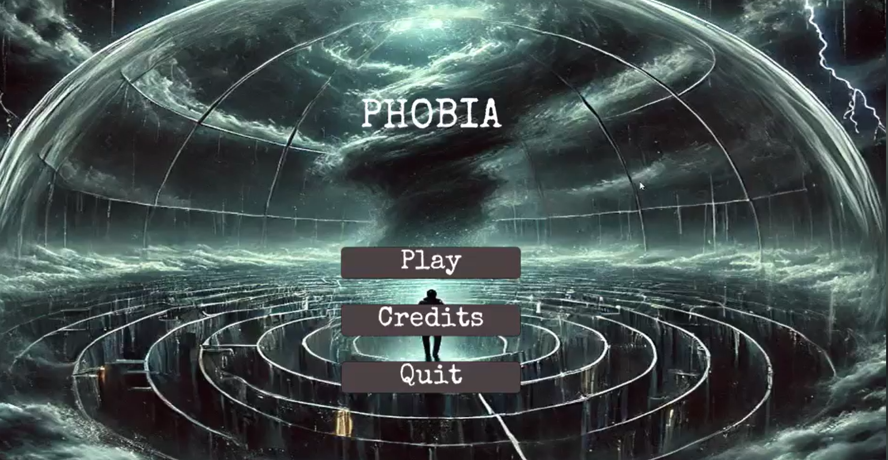
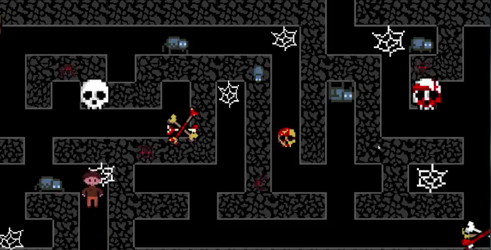
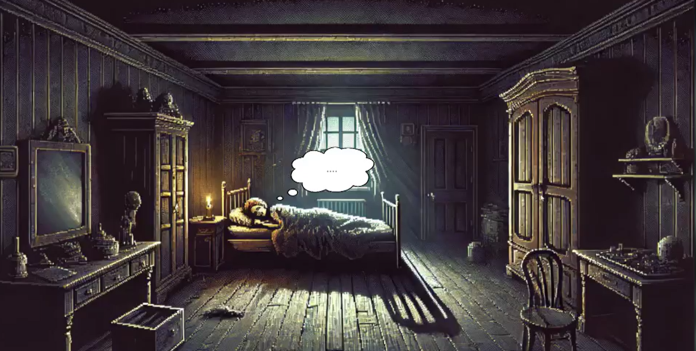

# PhobiaScape: Psychological Horror Puzzle

[](https://unity.com/)
[](https://opensource.org/licenses/MIT)

**PhobiaScape** is an atmospheric psychological horror game where players navigate through a series of dreamlike puzzles, each representing a distinct human fear. Survive the labyrinth, scale skyscrapers, and dive into the depths of the ocean to conquer your phobias.

---

## 📸 Gameplay Preview

| Labyrinth Exploration | Sky-high Heights | Deep Ocean Depths |
| :---: | :---: | :---: |
|  |  |  |
| *Find your way out of the maze.* | *Test your balance in the sky.* | *Face the monsters in the dark.* |

---

## 🌌 Features

- **Phobia-Driven Narrative**: Experience three unique levels, each tackling a different fear:
    1. **Claustrophobia / Maze (Labirent)**: Escape the confinement.
    2. **Acrophobia (Gokdelen)**: Navigate narrow paths at extreme heights.
    3. **Thalassophobia (Okyanus)**: Face the terrifying unknown of the deep water.
- **Dynamic Logic Puzzles**: Interactive components like the `ColorPuzzle` and `TextController` require precision and logic to progress.
- **Immersive Soundscape**: Integrated audio effects (heartbeats, breathing, atmospheric noises) that react to player proximity and scene state.
- **Responsive UI**: Intuitive menus and narrative balloons that guide the player through their subconscious journey.

---

## 🛠️ Technical Architecture

The project has been refactored for professional-grade modularity:

| Script | Purpose |
| :--- | :--- |
| `DreamController.cs` | Orchestrates the primary game loop and narrative progression using Coroutines. |
| `ColorPuzzle.cs` | Implementation of a logic-based scaling puzzle involving RGB combinations. |
| `TextController.cs` | Manages bitwise logic states for complex puzzle interactions and UI feedback. |
| `SceneController.cs` | A centralized hub for managing Unity scene transitions and application state. |
| `ObjectScaler.cs` | Flexible component for procedural object scaling and animations. |
| `GameEndController.cs` | Logic for handling the game's finale and returning to the main menu. |

---

## 🚀 Getting Started

### Prerequisites
- Windows OS (64-bit).
- [Unity 2022.3+](https://unity.com/) (For editing source code).

### Play the Game
1. Go to the `phobia-game/build/` directory.
2. Run `Phobia.exe`.

---

## 📂 Project Structure

```text
/
├── docs/             # Documentation & Assets
│   └── screenshots/  # Gameplay visual captures
├── phobia-game/       # Primary Game Folder
│   ├── build/        # Compiled Windows Executable
│   └── scripts/      # C# Source Code (Clean & Documented)
└── README.md         # Full project documentation
```

---

## 📝 License

This project is licensed under the MIT License - see the LICENSE file for details.

---
*Created with focus on Atmospheric Storytelling.*
